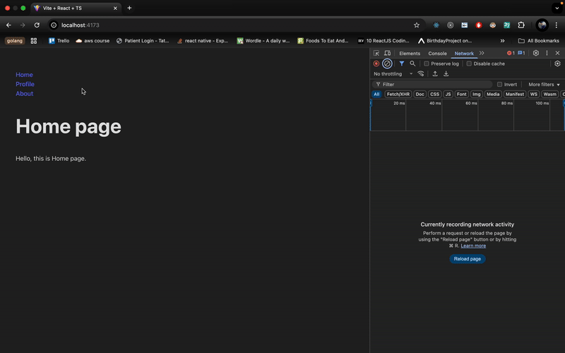
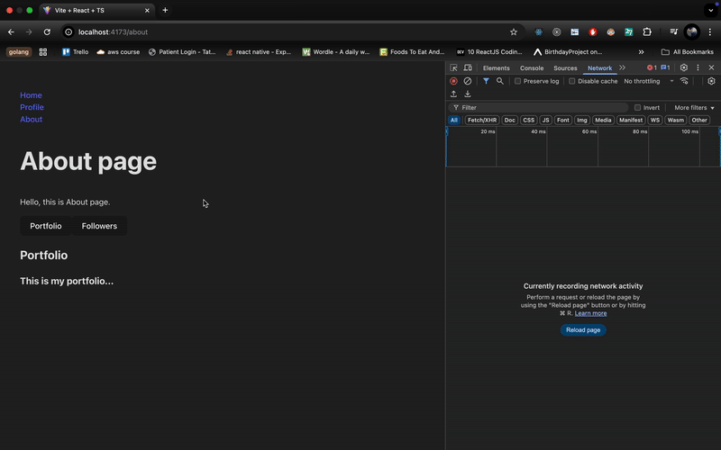

# Problem

React + TypeScript example demonstrating lazy loading and code splitting using React.lazy and Suspense.

This project demonstrates how to implement lazy loading and code splitting in a React application using TypeScript. It uses `React.lazy` and `Suspense` to dynamically load components and routes, improving the application's performance by reducing the initial bundle size.

## Feature 1 (Lazy Loading Pages)

- **Lazy Loading pages**: Pages/Routes like `Profile` are loaded only when needed, reducing the initial load time. Routes are split into separate chunks, ensuring that only the required code is loaded for each route.
- We have not lazy loaded the home page as it is visible in the first fold and it might affect FCP in that case
- **React Router Integration**: The project uses `react-router-dom` for navigation between pages.
- **Custom Loading Delay**: Demonstrates adding a delay before loading components using a custom `wait` function.
- We have not Lazy loaded About to test both scenarios.

- A valid use case for this can be for example we have a dashboard where profile is only visible after a user login. So it doesn't make sense to download the profile chunk even before logging in.

## Feature 2 (Lazy Loading Components)

- **Lazy Loading Components**: In the `About` page, we have done a similar kind of lazy loading, just with the 2 components. Here we have 2 tabs - `Portfolio` and `Followers`. We have lazy loaded those 2 components, and only when we click on follower would its chunk get downloaded.

- A valid use case for this is same as what we have used. lets say there are 5 different tabs which show 5 different huge components. it doesn't make sense to load all those 5 components at once. hence we will load them using lazy loading

